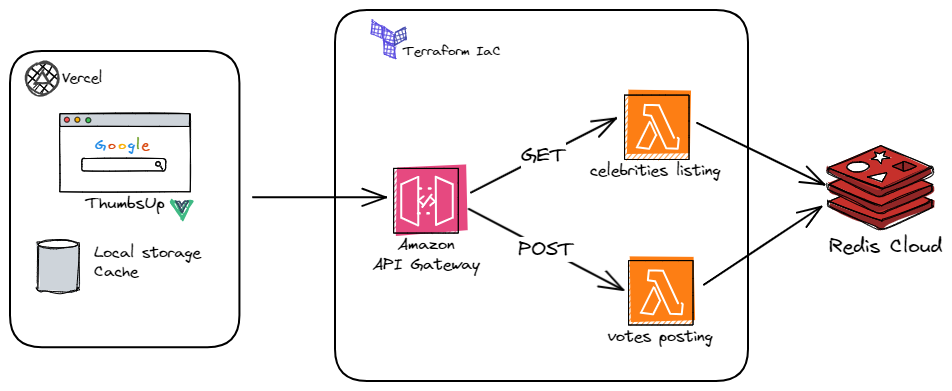
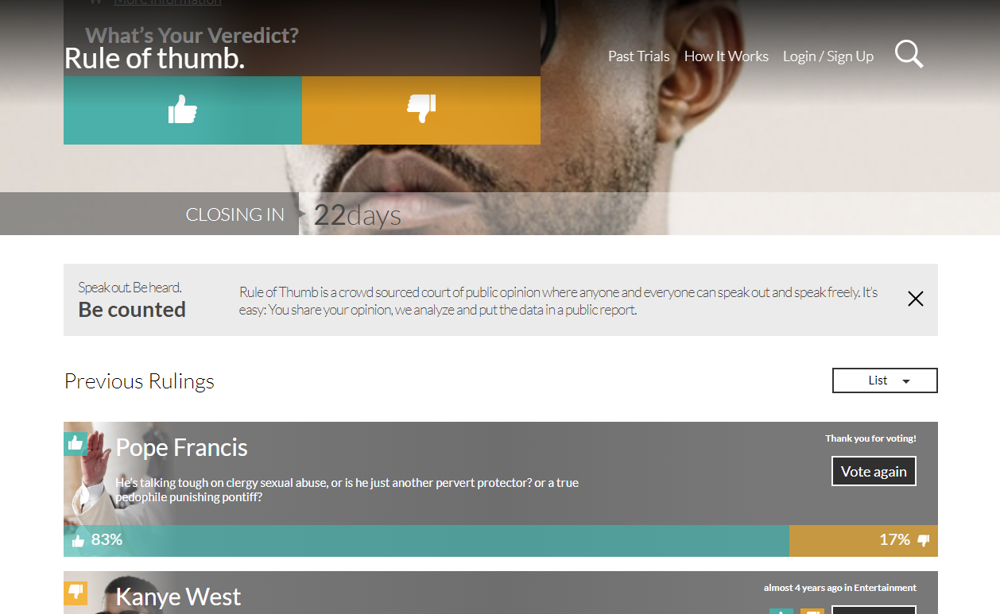

# Welcome to Thumbsup - Zemoga FED™️ 👍

We are a website that tracks the sentiment of its users on trending and controversial people from different fields, including politics, business, media, and entertainment.
- Supports live voting and quiiiick voting results. _(we promise it.)_
- Don't know who to vote for? 🌨️, We suggest you a random popular celebrity in our main banner for each visit!.
- We supports a nice layouts, you can use a _grided_ one or a _layered_ one. Choose wisely 🧙‍♂️, you can use your favorite device freely 📱.

## Live production URL ✨

Please visit https://thumbsup.duquejo.com/

# Technologies used

- Vue.JS 3 💘
- Typescript
- Pinia (Stage management)
- SASS
- Vite
- Vitest (Unit tests)
- Supertest (Integration tests)
- Yarn

## Utilities
- Axios: Better HTTP Requests handling approach.
- Date-fns: It makes Date Javascript manipulation work like a charm. 
- Semver: For lock node version (and make it more developer-teammates friendly).
- Prettier: Improves the code legilibility and organization
- Lint: Fixes the most frecuent bugs.

# Getting started (Local development)

1) Clone the (repository)[https://github.com/duquejo/ThumbsUp] and be sure to have Node 18.X version. (...or Semver will warn you 👀).
```sh
yarn
```

2) Install required dependencies.
```sh
yarn install
```

3) Copy `.env.sample` file and rename it as `.env` local development (it will work for whole enviroments) if you want to use the local mock, Leave it unchanged. The enviroments available are:
    - `.env`: local development (and the general enviroments fallback source).
    - `.env.test`: testing enviroment resources (If you want to run the integration tests).
    - `.env.production`: production enviroment resources (Connecting HTTP resources with the application).
```sh
# Celebrities listing endpoint (retrieves all celebs)
VITE_CELEBRITIES_URL=

# Vote system endpoint (post a nice vote for your selected celeb)
VITE_VOTES_URL=

# Site title URL (If you want a cool guy/gal).
VITE_APP_TITLE=
```

4. Enable the vite development mode.
```sh
yarn dev
```

5. Go to the vite provided development URL with the following URL: `http://localhost:8080`.

## Application tests

- For running unit tests with vitest in watch mode, use:
```sh
yarn test
```

- For retrieve unit tests coverage, use:
```sh
yarn test:coverage
```

- For running integration tests, use:
```sh
yarn test:integration
```

## Other commands
- Code formatting
```sh
yarn prettier
```

- Code Linting
```sh
yarn lint
```

## Are you a Docker enthusiast?
I dockerized the application, so I'm going to give you some useful commands to execute it. (You must have Docker installed).

1) Be sure you create the .env variables first. It will provide the production configuration as priority, so if you have a _.env.production_ file, it will be taken as the main configuration file, likewise the `.env` configuration will also be valid.

2) Build the docker image.
```sh
docker build -t thumbsup .
```

3) Run the dockerized image and port it to the 8080 port:
```sh
docker run -p 8080:8080 thumbsup
```
(OR) run it with the detached mode enabled:
```sh
docker run -d -p 8080:8080 thumbsup
```

4) If you want to enable an interactive sh interface while running the docker container, use:
```sh
# Tip: You can use `docker ps` for getting the running application container ID.
docker exec -it {container_id} sh
```

## Continous Integration - Deployment
This site is production-friendly / staging-friendly and it's configured to use Vercel and GitHub Actions for CI/CD.

So, If you want to contribute, you must follow the [GitFlow](https://nvie.com/posts/a-successful-git-branching-model/) basic rules.

For the `develop` branch, through GitHub Actions, the pushed commits will be deployed into Vercel's preview stage (You can view a temporal URL for watch changes live.), the celebrities data provided will be a JSON mock.

For the `main` branch, Github Actions will activate the production mode, getting all production `.env` variables and activating the AWS backend resources.

## How do I develop the backend service?
I got it following a quick (but efficient) microservices architecture. (If you want more details, visit [the backend repository]((https://github.com/duquejo/ThumbsUp_backend))):



## How I dealt with the heavy HTTP tasks concurrency?
I built a localStorage composable `@/composables/useLocalStorage` that Caches the listed results for 60 seconds, So, if the cache was created, it will wait for a vote interaction to refresh the cache instantly. Nevertheless, if the 60 seconds expire, it will get a fresh state from the backend service.

## Application captures

### Mobile


### Tablet


### Desktop


## Future Challenges and beloved ideas 🌨️
- Define ending voting time (close votes).
- Develop an auth system and link all buttons (maybe create an SPA using Vue Router).
- Replace the actual cache system with a more reliable one like [@TanStack/Query](https://tanstack.com/query/latest) (I love it).
- Abstract common components.
- Apply more accessibility principles.
- Build a design system with Storybook and apply atomic design principles. 
- Improve the dockerized application.
- Add SonarQube and configure quality gates based on unit tests coverage.
- Dynamic component/resouce imports and deploy manual chunks. _(Optimization)_
- Add e2e tests with Playwright or Cypress 🤖.

_Thank you so much_ 🎶